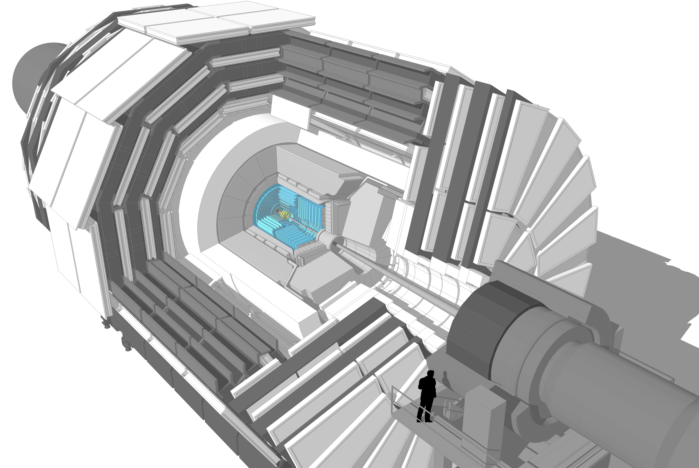

## Tracker

Momentum of particles is crucial in helping us to build up a picture of events at the heart of the collision. One method to calculate the momentum of a particle is to track its path through a magnetic field; the more curved the path, the less momentum the particle had. The CMS tracker records the paths taken by charged particles by finding their positions at a number of key points.

The tracker can reconstruct the paths of high-energy muons, electrons and hadrons (particles made up of quarks) as well as see tracks coming from the decay of very short-lived particles such as beauty or “b quarks” that will be used to study the differences between matter and antimatter.
The tracker needs to record particle paths accurately yet be lightweight so as to disturb the particle as little as possible. It does this by taking position measurements so accurate that tracks can be reliably reconstructed using just a few measurement points. Each measurement is accurate to 10 µm, a fraction of the width of a human hair. It is also the inner most layer of the detector and so receives the highest volume of particles: the construction materials were therefore carefully chosen to resist radiation.

The final design consists of a tracker made entirely of silicon: the pixels, at the very core of the detector and dealing with the highest intensity of particles, and the silicon microstrip detectors that surround it. As particles travel through the tracker the pixels and microstrips produce tiny electric signals that are amplified and detected. The tracker employs sensors covering an area the size of a tennis court, with 75 million separate electronic read-out channels: in the pixel detector there are some 6000 connections per square centimetre.

### Pixels

### Strips


